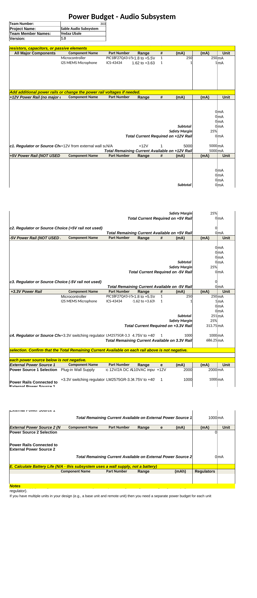

## Power Budget

### Overview

The Audio Subsystem is powered from a single +12V wall supply that feeds an on-board LM2575GR-3.3 switching regulator to produce the +3.3V rail used by all active components. Only one regulated rail is required for this subsystem because both the PIC18F27Q43 microcontroller and the ICS-43434 I²S MEMS microphone operate from +3.3V. A 25% safety margin is applied to the worst-case current draw on the +3.3V rail. The selected LM2575GR-3.3 regulator can supply up to 1000 mA, which leaves substantial headroom above the calculated rail demand of 313.75 mA. The 12V/2A wall supply provides more than enough capacity to drive the 3.3V regulator while leaving available current for other subsystems sharing the same external supply. This subsystem is wall-powered and does not include a battery, so battery life calculations do not apply.

### Power Budget Table

---

**Downloads:** [Excel (.xlsx)](Power_Budget_AudioSubsystem.xlsx) | [PDF](Power_Budget_AudioSubsystem.pdf)
